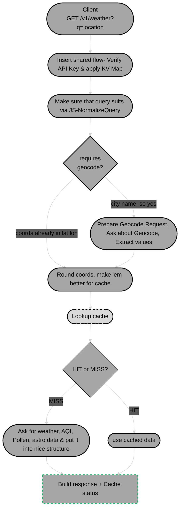

# 🌍 ATW — All Things Weather

> *What's going on outside the window?*
## [atw.zajkowski.cloud](https://atw.zajkowski.cloud/)
An over-engineered environmental dashboard built as a hands-on case study for **Apigee** as an API aggregation layer. Pulls live weather, air quality, UV, pollen and lunar data from several different providers, all proxied and uniformly authenticated through a single Apigee gateway.

## What it does

- **Current weather** — temperature, feels-like, humidity, wind, pressure, visibility
- **Air quality** — European AQI with pollutant breakdown (PM2.5, PM10, NO₂, O₃, CO)
- **UV index** — current + daily max, sunrise/sunset
- **6-day forecast** — daily highs/lows, conditions, precipitation, wind
- **AI-generated summary** — natural-language outlook from Gemini
- **Pollen** — grass, tree, weed risk levels with per-species breakdown
- **Satellite view** — interactive map centered on the queried location
- **Moon phase** — interactive 3D moon with real-time illumination, moonrise/moonset

## Architecture

Monorepo with a thin BFF pattern:


- **Frontend** — React 18, Tailwind, React Three Fiber for the 3D moon, Leaflet for the map
- **Backend** — Node.js + Express, single `/weather` endpoint that fans out to all upstream APIs in parallel and returns one consolidated payload
- **Gateway** — Apigee X handles auth (API key injection), rate limiting, caching, and request shaping

## Apigee features used

- Registered API Product with App credentials
- Reverse proxies with path rewriting (base URL for `v1/weather` and `v1/forecast-summary` → many upstream targets)
- Nearly 100% logic of creating forecast moved to JS policies inside proxies
- KVM (Key-Value Maps, or Key-Value) for storing secrets outside of policy XML
- Caching for repetetive data, HIT/MISS indicator in header




## ROADMAP TODO'S

### Apigee
- Fallback api for crucial weather data
- CloudLogging for cache hits, unauthorized request, quota alerts
- Mock API Tiering, quota per API Product- for example, weather + forecast for free tier, extra data with *"premium"* plan

### Source Code
- Couple repetitions in **/atw-weather/targets/default.xml** policy

### IaC & CICD
- Terraform files for apigee policies
- GitHub Actions

## Running locally

```bash
# install deps in each workspace
cd backend  && npm install
cd ../frontend && npm install

# backend needs APIGEE_BASE_URL in .env
cd backend && npm run dev

# frontend
cd frontend && npm run dev
```

### Note for front

This project is roughly 90% Claude-assisted — I'm not a frontend engineer, so the UI is intentionally minimal and follows whatever Claude suggested. If anything looks off, open an issue.

